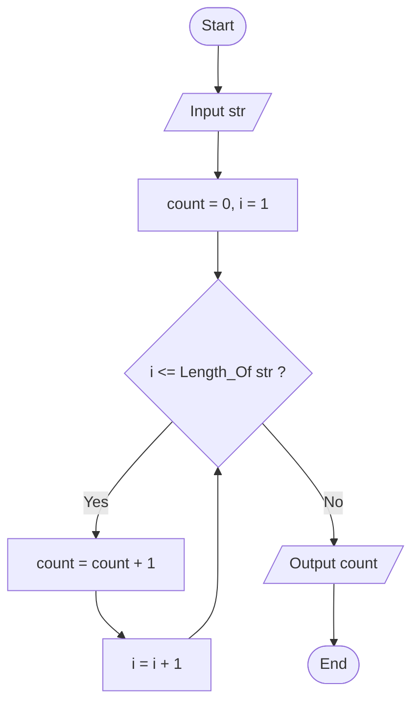

# Flowchart (Mermaid - renders on GitHub)

```mermaid
flowchart TD
    A([Start]) --> B[/Input str/]
    B --> C[count = 0, i = 1]
    C --> D{i <= Length_Of str ?}
    D -- Yes --> E[count = count + 1]
    E --> F[i = i + 1]
    F --> D
    D -- No --> G[/Output count/]
    G --> H([End])
```
