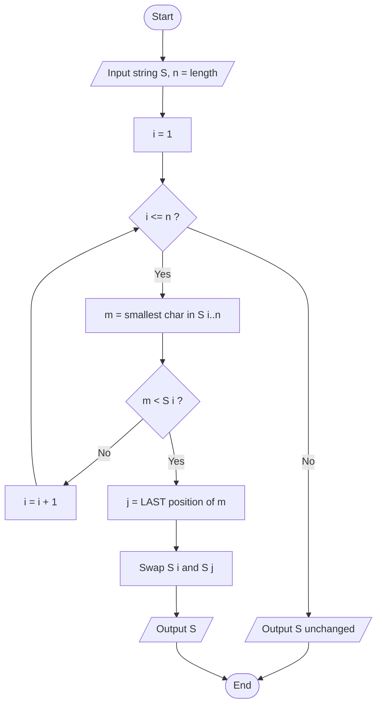

```mermaid
flowchart TD
    A([Start]) --> B[/Input string S, n = length/]
    B --> C[i = 1]
    C --> D{i <= n ?}
    D -- No --> Z[/Output S unchanged/] --> END([End])
    D -- Yes --> E[m = smallest char in S i..n]
    E --> F{m < S i ?}
    F -- No --> G[i = i + 1] --> D
    F -- Yes --> H[j = LAST position of m]
    H --> I[Swap S i and S j]
    I --> J[/Output S/] --> END
```
