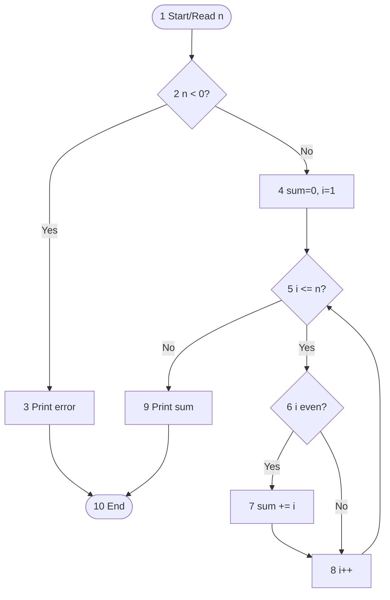

```mermaid
flowchart TD
 N1([1 Start/Read n]) --> N2{2 n < 0?}
 N2 -- Yes --> N3[3 Print error] --> N10([10 End])
 N2 -- No --> N4[4 sum=0, i=1] --> N5{5 i <= n?}
 N5 -- Yes --> N6{6 i even?}
 N6 -- Yes --> N7[7 sum += i] --> N8[8 i++]
 N6 -- No --> N8
 N8 --> N5
 N5 -- No --> N9[9 Print sum] --> N10
```
Result: E = 12, N = 10 -> V(G) = 12 - 10 + 2 = 4 (3 decision nodes + 1). See output/terminal_output.txt.
